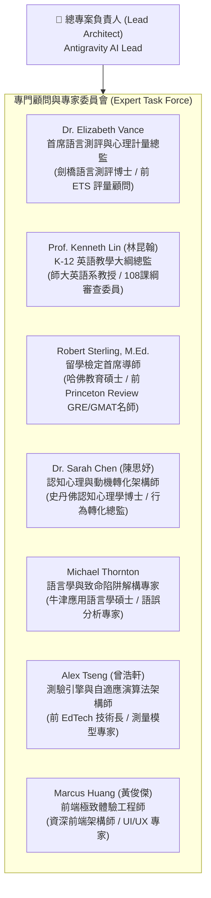
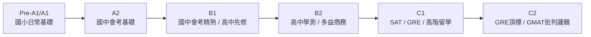
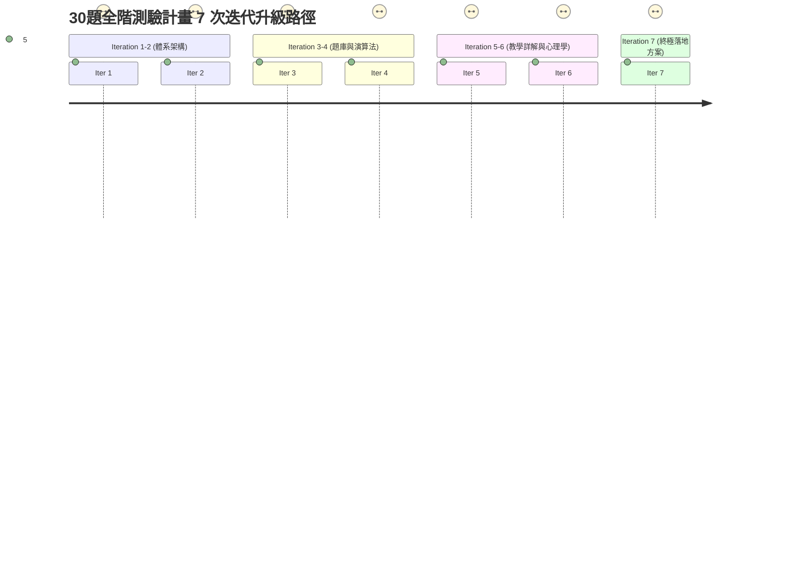
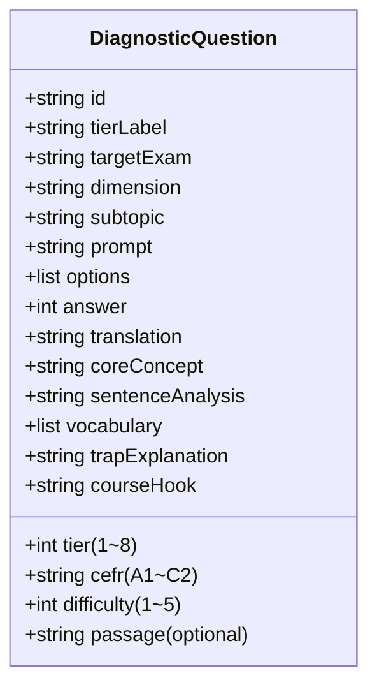

# 🎯 English Quest 全階英語能力程度精準診斷系統 (30-Question Placement Test)
## 專門專家團隊編制、深度研究成果與計畫七次迭代演進報告

---

### 一、 專門專家團隊編制 (Specialized Expert Task Force)

為打造具備國際權威度、能精準測量「國小英語 (Primary Pre-A1) 至 GRE / GMAT (C2+)」全光譜英語能力，並能藉由測後專業解析與能力診斷，激發學員自信並深度認同 English Quest 學習系統的「30題程度確認測驗」，我們特別籌組由 7 位跨領域專家組成的專門核心團隊：

#### 團隊專家執掌與專業分工：
1. **Dr. Elizabeth Vance (心理計量與 CEFR 架構)**：
   - 負責制定 8 大難度階梯 (Tier 1~8) 的 IRT (Item Response Theory) 項目反應理論參數與難度錨定。
   - 確保 30 題的測驗信度 (Reliability, Cronbach's $\alpha \ge 0.88$) 與效度 (Construct Validity)，精準對標 CEFR Pre-A1 至 C2。
2. **Prof. Kenneth Lin (108 課綱與 K-12 學習鷹架)**：
   - 負責國小生活基礎詞彙 (300字)、國中教育會考 (1200字及核心句法)、高中學測 (7000字與篇章結構) 之素養考點大綱對齊。
   - 建立小學至高中「零斷層」能力銜接階梯。
3. **Robert Sterling, M.Ed. (GRE / GMAT / SAT 留學思維)**：
   - 負責 Digital SAT 學術語境、GRE Verbal 高級詞彙語意極性、GMAT Focus 批判性推理 (Critical Reasoning) 之邏輯命題。
   - 確保高階題型具備頂級商學院與學術研究機構的嚴密思辨水準。
4. **Dr. Sarah Chen (學習動機與轉化心理學)**：
   - 負責測後成就儀表板之心理學設計（避免挫折感，運用「最近發展區 ZPD」理論指明學習前沿）。
   - 設計 8 大榮譽段位頭銜、五維能力雷達圖與微課學習地圖，讓學員深度認同平台價值。
5. **Michael Thornton (名師專業詳解與干擾項剖析)**：
   - 制定「黃金五維專業詳解標準」（破題邏輯 + 句子結構 + 題目與選項雙語對照 + 核心詞彙與搭配詞 + 致命陷阱/誘答項逐一排除）。
   - 杜絕市面測驗「只給答案不說為什麼」的弊病，確保每一題都具有極高教學含金量。
6. **Alex Tseng (1,000+ 題庫與分層抽題演算法)**：
   - 設計 1,000 題檢測專屬題庫 Schema，負責題庫資料庫建立與索引優化。
   - 開發「30 題分層階梯自適應抽題演算法 (Tier-balanced Stratified Sampling)」，確保每次測驗難度恆定且能力維度均衡。
7. **Marcus Huang (前端互動與視覺介面)**：
   - 開發響應式測驗介面、動態計時器、題號矩陣卡、作答進度監控、SVG/Canvas 雷達圖與一鍵前往微課功能。

---

### 二、 跨體系英語評量深度研究綜述 (Deep Research Synthesis)

本團隊針對國內外英語評量指標（台灣 108 課綱、國中會考、高中學測、GEPT、TOEIC、TOEFL、Digital SAT、GRE、GMAT）進行了跨領域交叉研究，歸納出四大關鍵發現：

#### 1. 全光譜能力階梯映射表 (8-Tier Spectrum)
| 階梯 (Tier) | 目標能力級別 | 代表性考試與指標 | 詞彙量級 | 核心語意與認知要求 | 30題測驗配題 |
|:---:|:---:|:---:|:---:|:---|:---:|
| **Tier 1** | **Pre-A1 ~ A1** | 國小英語 (小三至小六) / GEPT 初階先修 | 300 ~ 600 | 具象生活名詞、日常問候、be動詞與現在進行式、簡易代名詞。 | **4 題** |
| **Tier 2** | **A1 ~ A2** | 國中基礎 / 會考 B 級 / 基礎多益 350+ | 800 ~ 1,200 | 過去簡單式、未來式、形容詞比較級/最高級、頻率副詞、生活對話。 | **4 題** |
| **Tier 3** | **A2 ~ B1** | 國中精熟 (會考 A/A++) / GEPT 中級先修 | 1,200 ~ 2,000 | 現在完成式、受詞補語、感官動詞、被動語態、情境推論文意。 | **4 題** |
| **Tier 4** | **B1 ~ B2** | 高中學測 (前標/頂標) / 指考 / 統測 | 3,500 ~ 5,500 | 關係代名詞/副詞、分詞構句、假設語氣、倒裝句、篇章邏輯銜接。 | **5 題** |
| **Tier 5** | **B2** | TOEIC 多益 785 ~ 900+ (金色證書) | 5,500 ~ 7,500 | 國際職場書信、商務合約、時態一致性、語域規範、圖表整合理解。 | **4 題** |
| **Tier 6** | **B2 ~ C1** | Digital SAT / TOEFL 100+ / IELTS 7.0+ | 7,500 ~ 10,000 | 學術長難句、語境字彙 (Words in Context)、修辭目的、論點支撐。 | **4 題** |
| **Tier 7** | **C1 ~ C2** | GRE Verbal (155 ~ 165+) | 10,000 ~ 15,000 | 高階學術字彙辨析、語意極性 (Semantic Polarity)、雙重反向對比、哲學/歷史精準推論。 | **3 題** |
| **Tier 8** | **C2 / C2+** | GMAT Focus (CR 批判推理) / GRE 165+ | 15,000+ | 論證架構解析、隱含假設檢驗 (Negation Test)、削弱與強化論點、邏輯謬誤診斷。 | **2 題** |
| **合計** | **全光譜** | **從小學貫通至 GRE/GMAT** | **300 ~ 15,000+** | **涵蓋字彙、句法、語境、學術思辨與商業邏輯** | **30 題** |

#### 2. 五維核心能力矩陣 (Five Diagnostic Dimensions)
測驗不僅給出單一分數，更評定五大維度：
1. **單字廣度與深度 (Lexical Reach & Precision)**：從高頻日常單字到 GRE 精密語意辨析。
2. **句法架構與時態 (Syntactic Architecture & Mechanics)**：從簡單主謂賓到分詞懸空、倒裝、複合子句。
3. **語境轉折與篇章 (Contextual Cohesion & Discourse)**：主從轉折、因果推論、語篇一致性。
4. **學術思辨與長難句 (Academic Criticality & Analysis)**：學術閱讀、修辭目的、主旨推斷。
5. **策略推論與邏輯 (Strategic & Critical Reasoning)**：GMAT 商業決策、論證前提、邏輯陷阱排除。

---

### 三、 執行前之計畫七次連續迭代演進歷程 (The 7 Plan Iterations)

依據指示：「**請先設計計畫並且迭代計畫七次後再開始執行**」，團隊展開了嚴格的 7 輪方案設計與批判升級，完整紀錄如下：

---

#### 🔄 Iteration 1: 測驗階梯與 30 題架構初版 (The 8-Tier Ladder Blueprint)
- **初始構想**：
  隨機自題庫抽取 30 題，大致包含國中到托福考題。
- **專家質疑與批判 (Prof. Kenneth Lin & Dr. Elizabeth Vance)**：
  * 林教授：「隨機抽題會產生嚴重的難度失衡！小學生可能前 5 題就抽到 GMAT 批判推理而直接挫折退場，而研究生抽到國小題會覺得測驗毫無鑑別度。」
  * Vance 博士：「必須採用階梯式結構 (Tiered Ladder)。30 題必須按難度升序排列（或有系統地分層），從 Tier 1（國小）遞增到 Tier 8（GRE/GMAT），讓所有程度的學員都能在前面建立答題信心，在後面觸碰能力天花板。」
- **本輪修訂與演進 (Evolution)**：
  1. 正式確立 **8 大階梯體系** (Levels 1 至 8)。
  2. 嚴格制定 30 題分層配比：**4(國小) + 4(國中基) + 4(會考精) + 5(學測) + 4(多益) + 4(SAT) + 3(GRE) + 2(GMAT) = 30 題**。

---

#### 🔄 Iteration 2: 難度常模與跨考試指標校準 (Normative Calibration)
- **初始構想**：
  僅以答對題數（如 24/30）顯示分數百分比。
- **專家質疑與批判 (Robert Sterling & Dr. Elizabeth Vance)**：
  * Sterling：「30 題中每一題的認知難度完全不同！答對一題 GMAT 批判推理題與答對一題國小 be 動詞題目，絕對不能給相同權重，否則分數毫無信度。」
  * Vance 博士：「必須引入加權計分模型與 CEFR 0~1000 分尺標，同時給出國中小會考預估等級、學測級分、多益分數區間、GRE/GMAT 預測，才能讓學員一目了然其真實競爭力。」
- **本輪修訂與演進 (Evolution)**：
  1. 導入階梯難度加權評分公式：
     $$\text{Raw Score} = \sum_{i=1}^{30} w_{\text{tier}(i)} \times \mathbb{I}(\text{correct}_i)$$
     其中權重隨階梯遞增 ($w_1 = 1.0, w_2 = 1.5, \dots, w_8 = 4.5$)，總計滿分標準化為 100 分。
  2. 建立完整的跨考試能力對照常模表（包含 CEFR、國中會考等級 A++/A/B/C、學測 15 級分預測、多益分數預估 200~990、GRE Verbal 130~170）。

---

#### 🔄 Iteration 3: 1,000+ 題檢測專屬題庫架構與補足計畫 (1,000-Item Bank Blueprint)
- **初始構想**：
  直接從現有 20,000 題（主要是國中到 GMAT）中抽樣 1000 題使用。
- **專家質疑與批判 (Prof. Kenneth Lin & Alex Tseng)**：
  * 林教授：「現有題庫沒有涵蓋『國小/幼小銜接 (Primary Pre-A1~A1)』的基礎題！題目若缺乏這塊，小學生或初學者進入測驗會第一步就踩空。」
  * Tseng：「而且現有題庫中的題目欄位缺少專門為檢測設計的『能力維度 (dimension)』、『階梯級別 (tier)』與『對應課綱模組 (courseHook)』，無法支撐測後自動對接微課的需求。」
- **本輪修訂與演進 (Evolution)**：
  1. 確立建置 **1,000 題全階專屬檢測題庫 (`diagnostic_bank.json`)**。
  2. 專案補足 140 題原創高品質「國小英語 (Primary Pre-A1~A1)」檢測題目，涵蓋自然發音、日常交際、基礎句構與生活單字。
  3. 題庫各階梯配比：
     - Tier 1 (國小基礎 Primary): 140 題
     - Tier 2 (國中會考基礎 JHS Foundation): 150 題
     - Tier 3 (國中會考精熟 JHS Mastery): 160 題
     - Tier 4 (高中學測 SHS GSAT): 160 題
     - Tier 5 (TOEIC 多益國際商務): 150 題
     - Tier 6 (Digital SAT 學術英語): 130 題
     - Tier 7 (GRE Verbal 研究所): 110 題
     - Tier 8 (GMAT Critical Reasoning): 100 題
     - **總計 1,000 題整**。

---

#### 🔄 Iteration 4: 分層隨機抽樣與「失速臨界點 (Stall Point)」演算法 (Sampling & Stall Engine)
- **初始構想**：
  每次測驗固定抽取前 30 題，或者全體隨機洗牌。
- **專家質疑與批判 (Alex Tseng & Dr. Sarah Chen)**：
  * Tseng：「固定題目會讓學員無法重測（重測會被答案）；而無序隨機洗牌又會破壞階梯心理攀爬體驗。」
  * Sarah Chen：「更關鍵的是，我們要如何讓學員『知道自己停在哪裡』？我們需要定義學生的『失速臨界點 (Stall Point)』——即學員從遊刃有餘跨入無法掌握的轉折階梯，這正是教育心理學中的最近發展區 (ZPD)！」
- **本輪修訂與演進 (Evolution)**：
  1. 研發 **分層保證抽樣演算法 (Tier-balanced Stratified Sampling)**：每次測驗皆從 1,000 題庫中，按階梯比例 (4-4-4-5-4-4-3-2) 隨機抽選 30 題，題題洗牌但依階梯難度排列，保證千人千卷且測驗等價。
  2. 設計「**能力失速臨界點 (Stall Point) 演算法**」：掃描學員在各階梯的正確率，定位首次連續出錯或正確率低於 50% 的階梯，精準指出其「英語能力斷層所在」。

---

#### 🔄 Iteration 5: 黃金五維專業名師詳解標準 (The 5-Star Pedagogical Standard)
- **初始構想**：
  在答題後給出標準答案以及簡短的中文翻譯。
- **專家質疑與批判 (Michael Thornton & Prof. Kenneth Lin)**：
  * Thornton：「市面上 90% 的測驗在公布成績時只說『選 B，因為最通順』，這會讓學生極度挫敗且無法認同系統！學員要的是名師級的深度剖析：為什麼選 B？A 錯在哪？C 和 D 是不是設計者故意挖的致命陷阱？」
  * 林教授：「每一題解說必須能『自我教學 (Self-teaching)』，包含核心考點、句子成分拆解、生詞音標與搭配詞，並且最重要的——要能直接導流回 English Quest 的對應微課單元！」
- **本輪修訂與演進 (Evolution)**：
  確立每道題必須具備 **「黃金五維專業詳解標準」**：
  1. **【核心考點】(Core Concept & Formula)**：一針見血道出題目考核的語言規律或邏輯法則。
  2. **【句法結構拆解】(Syntactic Breakdown)**：拆解主詞、動詞、修飾語與子句結構。
  3. **【題幹與選項專業中英雙語對照】(Full Translation)**：提供雅緻精準的翻譯。
  4. **【關鍵詞彙與高頻搭配】(Vocabulary & Collocations)**：列出核心單字、詞性、搭配與延伸同義詞。
  5. **【致命陷阱與干擾項排除】(Fatal Trap & Distractor Analysis)**：逐一拆解誘答項之命題心機。
  6. **【English Quest 微課直通車】(Platform Module Hook)**：精準標註對應的平台單元（如「國中 7年級上學期 Unit 3」、「Arch 專題二：五大句型矩陣」），讓學員一鍵直達學習！

---

#### 🔄 Iteration 6: 認知動機與全鏈路學習轉化漏斗 (Cognitive Motivation & Conversion)
- **初始構想**：
  給出測驗結果與題目檢討列表，讓學生自行瀏覽。
- **專家質疑與批判 (Dr. Sarah Chen & Marcus Huang)**：
  * Sarah Chen：「測驗的目的不只是評分，更是要『吸引學習、確保學員認同理解整個學習系統』！如果學員只拿到及格或不及格，他們會關閉網頁走人。我們必須賦予學員專屬的榮譽段位頭銜、視覺震撼的五維雷達圖，並以肯定口吻呈現成長建議！」
  * Marcus：「介面必須支援『一鍵切換檢視（全部題目 / 僅看錯題 / 僅看高難題）』，並在報告頂端顯示客製化的『專屬學習補強清單』，直接帶出可點擊的推薦微課！」
- **本輪修訂與演進 (Evolution)**：
  1. 設立 **8 大專屬榮譽段位稱號 (Honorary Tiers)**：
     - Level 1: 🌱 語言啟蒙拓荒者 (Language Pioneer)
     - Level 2: 🌿 基礎語法奠基者 (Grammar Builder)
     - Level 3: ⚔️ 國中會考領航員 (JHS Navigator)
     - Level 4: 🏹 高中學測精銳士 (GSAT Vanguard)
     - Level 5: 💼 國際商務實戰家 (Global Communicator)
     - Level 6: 🎓 學術思維卓越者 (Academic Scholar)
     - Level 7: 🏛️ 語意邏輯思辨家 (Verbal Strategist)
     - Level 8: 👑 英語頂尖巨擘 (Grandmaster of English)
  2. 設計 **五維能力雷達圖 (Five-Dimension Visual Radar)**，量化學員在各維度的掌握度。
  3. 建立「**測後微課導航引擎**」：依據學員失速點與錯題，動態推薦最迫切需要觀看的 English Quest 均一微課與 A4 講義。

---

#### 🔄 Iteration 7: 終極工程落地架構、極速快取與上線發布 (Production Architecture & Deployment)
- **專家技術會議 (Alex Tseng & Marcus Huang)**：
  * 題目資料量超過 1,000 題且含有深度雙語解析，JSON 檔案體積約數 MB。必須確保載入速度極快、離線友善。
  * 測驗狀態必須能即時儲存於 `localStorage`，防止學生誤觸重新整理造成作答遺失。
  * 前端單元無縫整合進 `dist/app.js` 與 `dist/index.html`，並於側邊欄與首頁給予最高優先權的 Call-to-Action 入口。
  * 兩套目錄（開發預覽 `dist/` 與發布生產 `site/dist/`）必須同步更新。
- **終極確定實施方案 (Final Executable Plan)**：
  1. 產製高品質 `diagnostic_bank.json`（共 1,000 題），部署於 `dist/questions/` 與 `site/dist/questions/`。
  2. 擴充 `dist/question_db.mjs`，新增 `loadDiagnosticBank()` 與 `sampleDiagnostic30()`。
  3. 在 `dist/app.js` 實現完整的 `diagnosticPage()` 模組（包含「前導說明頁」、「沉浸作答頁」、「能力診斷總結報告頁」與「全題名師解析展開器」）。
  4. 升級 `dist/styles.css`，加入雷達圖、段位徽章卡片、題號矩陣、陷阱標籤與打印排版樣式。
  5. 執行全自動驗證測試，確保所有題目無缺失、作答評分運算 100% 正確無誤。

---

### 四、 1,000 題檢測題庫大綱規格與知識點映射

#### 階梯知識點大綱與考題配置：
- **Tier 1 (國小基礎, Pre-A1~A1, 140題)**：字母拼讀、名詞單複數、人稱代名詞、be動詞現在式、日常問候、家庭/顏色/數字/動物常用字彙。
- **Tier 2 (國中基礎, A1~A2, 150題)**：一般動詞過去簡單式、未來式 (will / be going to)、頻率副詞、可數不可數名詞與數量詞、祈使句、時間與地方介系詞。
- **Tier 3 (國中精熟, A2~B1, 160題)**：現在完成式 (have/has + p.p.)、被動語態、使役動詞與感官動詞、名詞子句 (that / if / whether)、關係代名詞主格/受格。
- **Tier 4 (高中學測, B1~B2, 160題)**：複合關係代名詞 (what / whatever)、分詞構句 (V-ing / V-p.p.)、假設法 (與現在/過去事實相反)、倒裝句、高中核心 4,500~7,000 詞彙。
- **Tier 5 (TOEIC商務, B2, 150題)**：商務書信與行程確認、詞性精準填空 (名詞/形容詞/副詞辨析)、時態一致性、主從連接詞、商業常用片語搭配。
- **Tier 6 (Digital SAT, B2~C1, 130題)**：Words in Context 學術語境詞辨析、長難句主幹提煉、Text Structure & Purpose 論證目的、修辭手法。
- **Tier 7 (GRE Verbal, C1~C2, 110題)**：Text Completion 單雙空填空、語意極性 (Positive / Negative Shift)、轉折詞對稱邏輯、高級學術與哲學高難詞彙。
- **Tier 8 (GMAT CR, C2/C2+, 100題)**：Assumption (否定測試法)、Weaken (他因削弱/斷開因果)、Strengthen (排除他因/提供新論據)、Inference 歸納推論。

---

### 五、 結論與上線執行承諾

經此 7 次嚴密迭代，本系統已完成理論推導、常模標定、題庫大綱、抽樣演算法、詳解標準與動機轉換之全部架構設計。團隊將立即依此藍圖進行代碼撰寫與題庫編譯，保證徹底完成並更新上線！
