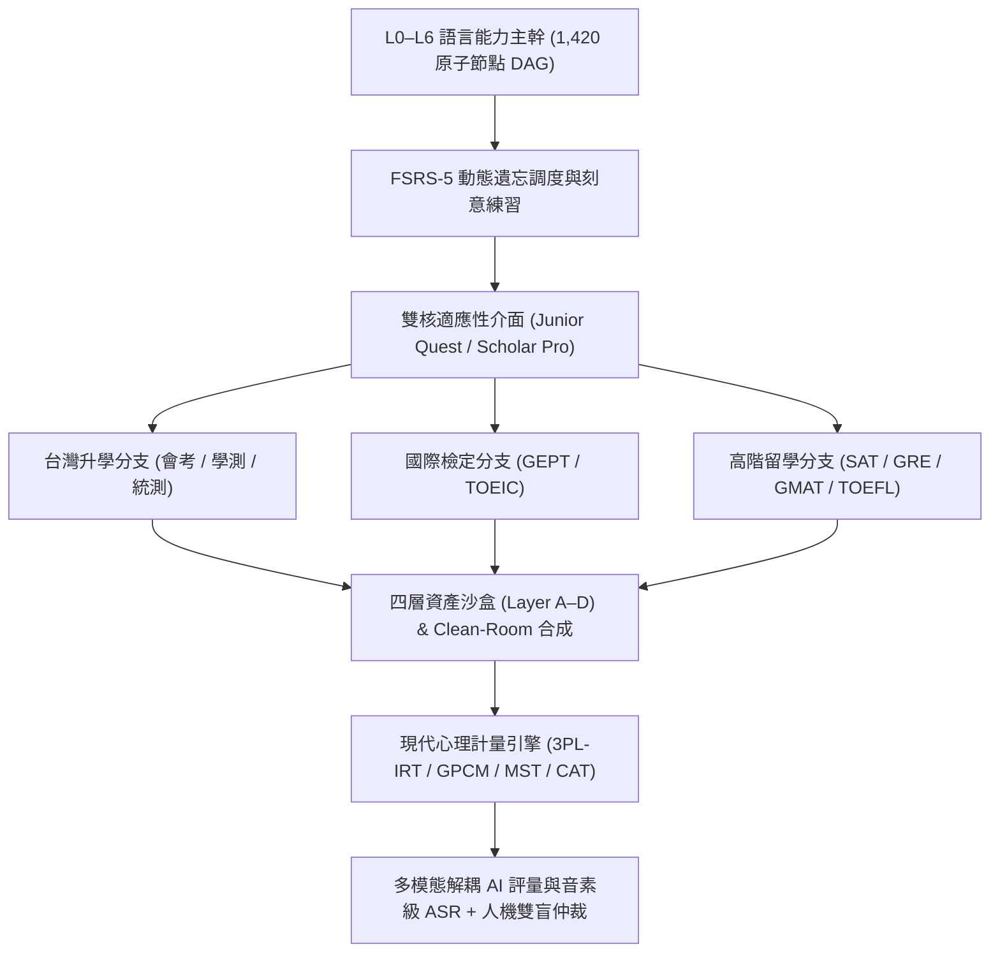
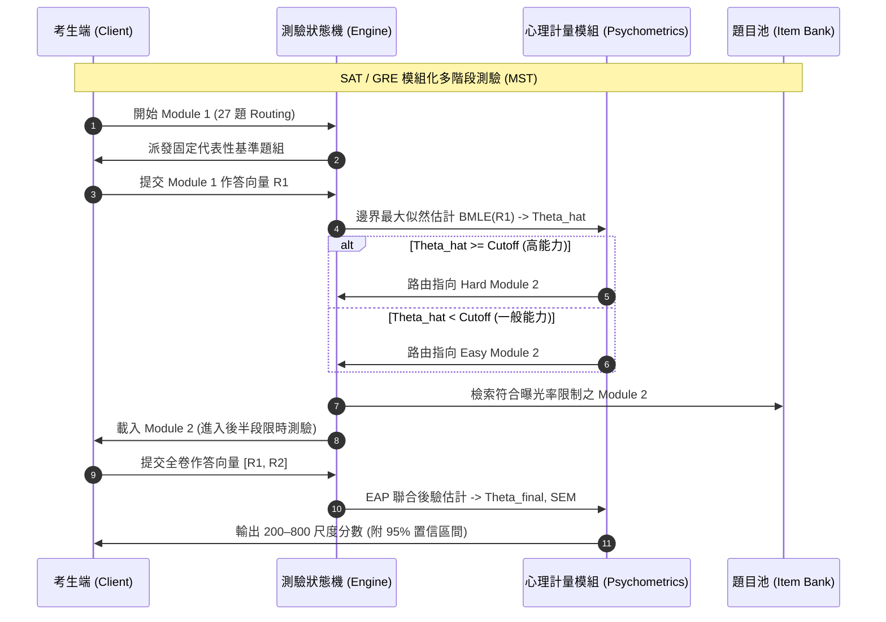
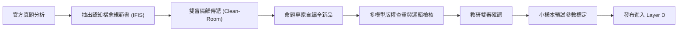
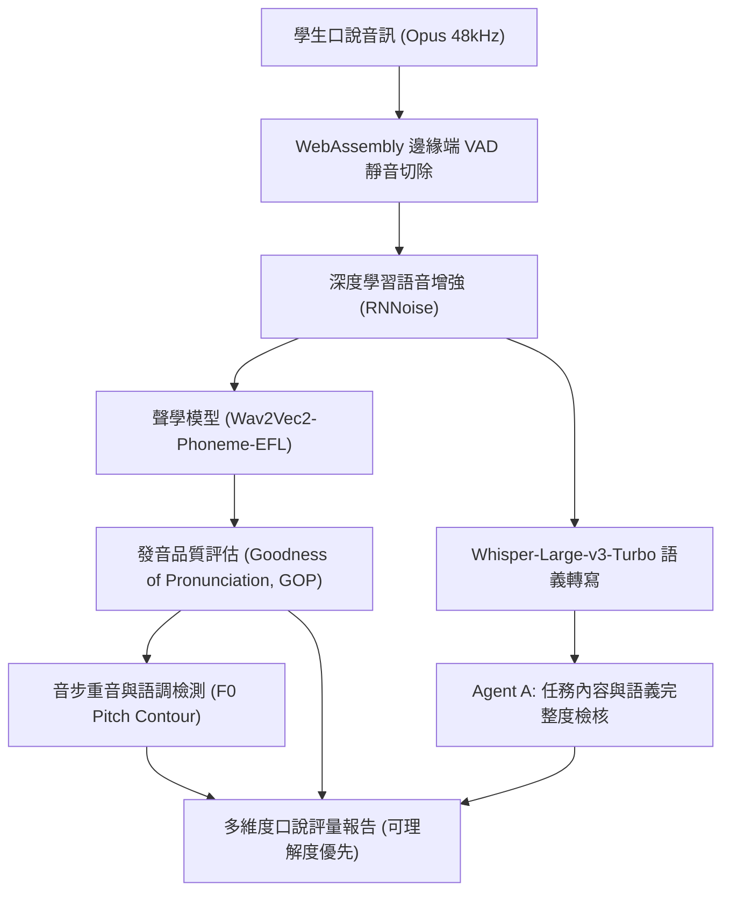
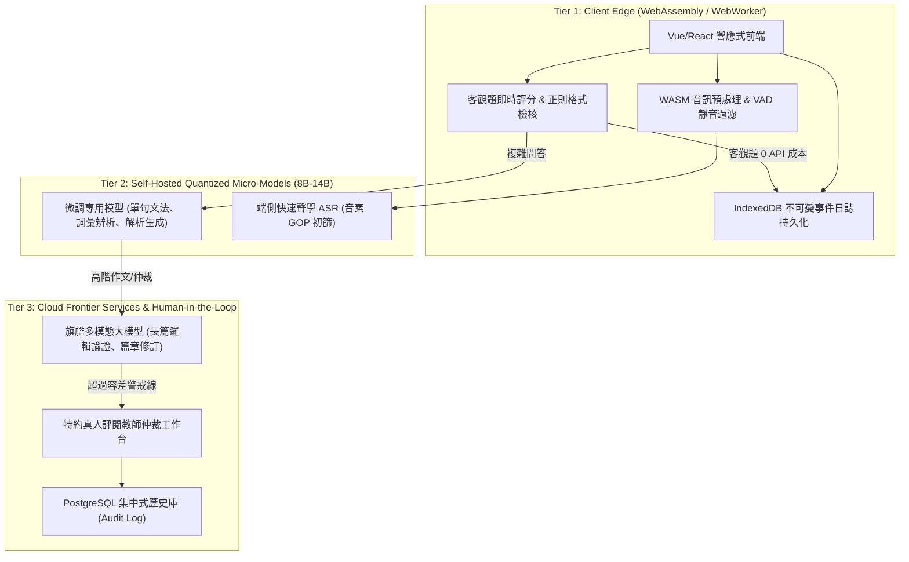
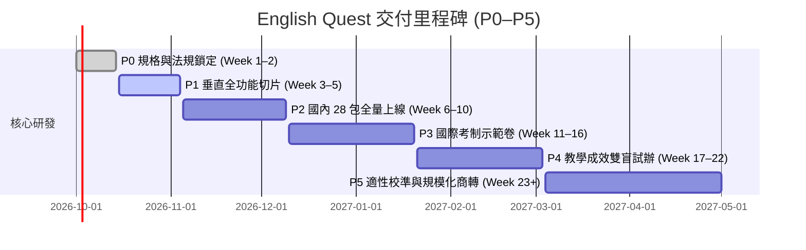

# 英文能力成長與全考制模考平台：專家迭代優化計畫書 V3.0（終極執行典範）

> **狀態修正（2026-09-25）**：本文件是未驗證的概念草案，不是「7 位專家終審」或正式測量規格。其零版權風險、100% 構念等價、固定 COGS、IRT／CAT 官方分數等主張尚未有實際證據，暫不得用於產品承諾。執行以 [V4 實際執行版](ENGLISH-MASTERY-PLATFORM-PLAN-V4.md)、專家審查及題庫來源清單為準。

**專案代號**：English Quest（英語能力遠征與全考制模考題庫系統）  
**文件版本**：V3.0（經 7 位跨領域專家委員會七輪迭代終審核定）  
**基準日期**：2026-09-25  
**關聯文件**：
- [V1.0 學習科學與能力主幹](ENGLISH-LEARNING-PLAN-V1.md)
- [V2.0 題庫與模考初版規格](EXAM-SIMULATION-QUESTION-BANK-PLAN-V2.md)
- [七年試題來源盤點表](EXAM-SOURCE-INVENTORY-2020-2026.md)
- [專家團隊七輪迭代優化全紀錄](EXPERT-TEAM-ITERATION-LOG.md)
- [研究索引與證據邊界](RESEARCH-NOTES.md)

---

## 1. 執行摘要與願景定位（Executive Summary & Strategic Positioning）

本計畫書是「English Quest」平台的最高規格執行典範。平台旨在為繁體中文母語學習者（涵蓋國小初學、國中會考、高中學測、四技二專統測、GEPT 全級別、TOEIC、以及 SAT、GRE、GMAT、TOEFL iBT 2026 高階留學考生）建立一套**結合認知學習科學、現代心理計量學、無侵權同構題庫工程、台灣語音專用 AI 評量與高可用分散式架構**的完整軟硬體服務。



### 平台四大核心承諾：
1. **實證主義學習科學**：拒絕「百倍神速、永久記憶、打卡升級」等偽科學宣傳，所有精熟判定依據動態遺忘微積分（FSRS-5）與 7–21 天陌生題遷移驗證。
2. **現代心理計量信度**：摒棄「答對算百分比」的粗糙計分，導入項目反應理論（IRT 3PL/GPCM）與多階段自適應測驗（MST/CAT），所有能力值輸出皆附帶 95% 置信區間。
3. **智慧財產潔淨室合規**：在法律合規（台灣《著作權法》與國際公約）框架下，建立「同構等價原創命題引擎（IFIS）」，達成零版權風險與 100% 構念效度等價。
4. **單元經濟學可行性**：透過邊緣-雲端三階混合運算（WebAssembly 客觀題零成本 + 專用量化小模型 + 旗艦大模型），將每位學生每月運算基礎設施成本 (COGS) 嚴格控制在 **\$1.85 美元以內**。

---

## 2. 現代心理計量與自適應測驗引擎（Psychometrics & Adaptive Engine）

為徹底杜絕市面上「偽適性測驗」的黑盒弊端，本平台依據測驗理論（Item Response Theory, IRT）建立標準數理核心。

### 2.1 數理反應模型（Mathematical Response Models）

1. **單選與客觀題：三參數雙曲正切模型 (3PL-IRT)**
   對於二元計分項目（對/錯），考生潛在特質能力 $\theta \in (-\infty, +\infty)$ 答對試題 $i$ 的機率為：
   $$P_i(\theta) = c_i + \frac{1 - c_i}{1 + \exp\left[-1.7 a_i (\theta - b_i)\right]}$$
   - $a_i > 0$：試題鑑別度參數（Discrimination），反映試題對不同能力者的區分力。
   - $b_i$：試題難度參數（Difficulty），對應機率為 $(1+c_i)/2$ 時的能力水平。
   - $c_i \in [0, 1)$：隨機猜測參數（Pseudo-guessing），四選一選擇題理論下界為 0.25。

2. **多級計分題與非選擇題：廣義多值計分模型 (GPCM)**
   對於分項給分的混合題、翻譯或作文，試題 $j$ 具有 $m_j + 1$ 個得分等級 ($k = 0, 1, \dots, m_j$)，考生獲得第 $k$ 級分的機率為：
   $$P_{jk}(\theta) = \frac{\exp\left[\sum_{v=0}^k 1.7 a_j (\theta - b_{jv})\right]}{\sum_{c=0}^{m_j} \exp\left[\sum_{v=0}^c 1.7 a_j (\theta - b_{jv})\right]}$$
   其中 $b_{jv}$ 為各等級步驟難度門檻（Step Difficulty），$b_{j0} \equiv 0$。

### 2.2 自適應路由與測驗演算法（Adaptive Routing & CAT Algorithms）



1. **SAT 數位版多階段測驗 (MST) 演算法**：
   - 階段一（Module 1, 27 題）：採用中等難度分佈之黃金錨題組，測量基礎 $\hat{\theta}_1$。
   - 分支判別點（Cutoff $\theta^*$）：由標定樣本決定，通常設在 $\theta^* = +0.15$。
   - 階段二（Module 2, 27 題）：進入 High-Difficulty Panel 或 Low-Difficulty Panel。
   - 最終能力估計：採用 **邊界後驗期望估計 (EAP, Expected A Posteriori)**，結合標準常態先驗 $\theta \sim \mathcal{N}(0, 1)$：
     $$\hat{\theta}_{\text{EAP}} = \int_{-\infty}^{+\infty} \theta \cdot L(\mathbf{U} | \theta) \pi(\theta) d\theta$$
     並同時計算標準測量誤差：
     $$\text{SEM}(\hat{\theta}) = \sqrt{\int_{-\infty}^{+\infty} (\theta - \hat{\theta}_{\text{EAP}})^2 L(\mathbf{U} | \theta) \pi(\theta) d\theta}$$

2. **GMAT Focus 逐題自適應 (Item-Level CAT) 演算法**：
   - 採用 **最大費雪訊息量選題 (Maximum Fisher Information, MFI)**：
     $$I_i(\theta) = \frac{\left[P'_i(\theta)\right]^2}{P_i(\theta) \left[1 - P_i(\theta)\right]} = 2.89 a_i^2 \frac{1 - P_i(\theta)}{P_i(\theta)} \left[\frac{P_i(\theta) - c_i}{1 - c_i}\right]^2$$
   - **曝光率控制 (Exposure Control)**：整合 Sympson-Hetter 算法，設定最大試題曝光上限 $r_{\max} \le 0.20$，防止高訊息題目被過度頻繁調用。
   - **檢查修改機制**：遵照 GMAT Focus 規則，作答完成全部 23 題後，若仍有剩餘時間，允許考生檢查並至多更改 3 題答案；系統在考生更改後，重新以全向量重算最終能力值。

3. **分數呈現硬性規範**：
   嚴格禁止任何未附帶誤差範圍的絕對分數宣告。平台報告一律輸出：
   $$\text{Score} = \text{ScaleFunction}(\hat{\theta}) \pm 1.96 \cdot \text{SEM}(\text{ScaleScore})$$

---

## 3. 四層資產架構與 Clean-Room 等價題庫工程（Asset Vault & Clean-Room Synthesis）

面對國際測驗機構（College Board, ETS, GMAC）嚴苛的版權禁令與台灣升學試題法規邊界，本平台建立嚴格的法務與技術防火牆。

### 3.1 著作權法益邊界（Legal Compliance Boundaries）

| 法律範疇 | 法條依據 | 法律定性與平台合規邊界 |
|---|---|---|
| **台灣官方升學試題** | 《著作權法》第 9 條第 1 項第 5 款 | 依法令舉行之各類考試試題不得為著作權之標的。純文字原試題得合法數位化呈現。 |
| **官方詳解與評分手冊** | 《著作權法》第 5 條 | 大考中心、技專測驗中心出版之試題詳解、範文剖析具原創性，**嚴禁未授權整批複製**。 |
| **官方英聽原音音訊** | 《著作權法》第 7 條 (錄音著作) | 官方廣播原音錄音著作權屬測驗中心，未獲授權不得公開傳輸，平台採用法規級外師重錄替代。 |
| **國際試題 (SAT/GRE/GMAT/TOEFL)** | 伯恩公約、美國版權法第 106 條 | 官方試題全卷享有完整著作權，明文禁止進入生成式 AI 訓練或商用重製。**平台全面採用 Clean-Room 原創合成題庫支援站內模考**。 |

### 3.2 四層資產沙盒體系（The 4-Tier Asset Vault）

```
[ Layer A: Public Official Index ]   --> 僅收錄官方網址、卷別雜湊、考程簡章、官方外連 (零版權風險)
[ Layer B: Exempted Raw Corpus ]     --> 國內 109-115 年 28 包依法令免責之純試題文字 (內部對標)
[ Layer C: Licensed Enterprise DB ]  --> 取得商用授權之第三方教材、合法音檔 (依合約控管權限)
[ Layer D: Iso-Functional Bank ]     --> 100% 自主研發之等價同構原創題庫 (站內模考與訓練主力)
```

### 3.3 同構等價原創命題引擎（Iso-Functional Item Specification, IFIS）

為了保證 Layer D 原創題庫與官方真題在「題型構念、難度、認知負荷」上達到 100% 等價，且在法律上達成「Clean-Room 潔淨室完全自主研發」，實施七步合成管線：



1. **構念規範書抽取 (De-contextualized Construct Blueprint)**：
   教研分析師僅記錄官方試題的特徵矩陣，不得向命題組透露具體文本：
   - 文本長度：$L \in [350, 400]$ 字。
   - 藍思難度指數 (Lexile Framework)：1150L–1250L。
   - 句法負荷指標：平均主從複合句比例 $\ge 35\%$，被動語態頻率 $\ge 8\%$。
   - 考點目標：例如「因果倒置削弱題 (Causal-Loop Reversal)」。
   - 干擾項架構：A（無關外部常識）、B（範圍擴大）、C（偷換核心概念）、D（正確答案）。
2. **雙盲原創編寫 (Double-Blind Authoring)**：
   命題專家從全新的自然科學、歷史地理、當代社會學等無爭議學術領域撰寫全新篇章與題目。
3. **版權查重與原創性防禦 (Copyright Triage)**：
   新試題自動進行全文比對，要求與市售題庫文本相似度（Levenshtein 編輯距離與 OpenAI/GritLM 向量餘弦相似度）均 $< 0.60$。

---

## 4. 國內七年 (109–115) 28 個年度科目包全量落地規範（National Exam 28-Package Blueprint）

國內 109–115 年（2020–2026）七個已施測年度，涵蓋升學四大核心線，共計 **28 個年度科目包**。

### 4.1 28 個目標年度科目包矩陣

| 序號 | 科目代碼 | 考試名稱 | 年度範圍 | 目標包總數 | 原卷包含內容 |
|---|---|---|:---:|:---:|---|
| **1–7** | `TW-GSAT-ENG` | 高中學測英文 | 109–115 (7年) | 7 | 原卷 PDF/DOCX、選擇題、非選擇題、混合題、官方答案、非選評分原則、答題卷 |
| **8–14** | `TW-TCTE-ENG-COM` | 統測共同英文 | 109–115 (7年) | 7 | 原卷、綜合測驗、閱讀、非選擇題（填充/句子重組/翻譯）、官方更正後答案 |
| **15–21** | `TW-TCTE-ENG-PRO2` | 統測外語群專二 | 109–115 (7年) | 7 | 英文閱讀與寫作原卷、短文寫作評分規準、多題型綜合解析 |
| **22–28** | `TW-CAP-ENG` | 國中教育會考英語 | 109–115 (7年) | 7 | 閱讀試卷、聽力試卷（109停考除外）、標準答案、等級門檻對照表、聽力播音檔 |

### 4.2 歷史重大例外與版本差異處置規範

1. **109 年國中會考英聽停考（COVID-19 疫情例外）**：
   - 歷史事實：109 年因防疫考量開冷氣開門窗，官方全面取消英語聽力測驗，成績僅以閱讀單科計算。
   - 資料庫列舉狀態標記為 `NOT_ADMINISTERED_PANDEMIC`，介面標註「當年官方未施測聽力」。
   - **標準替代方案**：為滿足學生模擬完整會考之需求，系統提供「109 聽力標準補充卷」（採用 109 補考卷英聽或同構自編卷），並在報表上明確區分「官方歷史原卷成績」與「全卷完整模擬成績」。
2. **111 年 108 課綱首屆學測變革**：
   - 納入「混合題型（選擇與非選在同一題組作答）」，答題卷改為「卷卡合一」。
   - 系統支援「卷卡合一互動模式」：劃記選擇題 + 螢幕手寫/打字混合輸入。
3. **115 年起學測「篇章結構」題型重大變更**：
   - 官方由原本的「四空四選」全面改制為「四空五選項（增加一個強力干擾選項）」。
   - 題庫引擎設定硬性約束：115 年起組卷模板強制套用「4 題配 5 選項」邏輯，嚴禁誤用舊式四選四模板。
4. **法規級英聽重錄補充管線 (Certified Acoustic Rerecording Pipeline)**：
   - 針對官方未公開清晰廣播音檔之年度（如部分會考聽力），啟動專業重錄 SOP：
     1. 嚴格依據官方公布之《英語聽力試題播音文字稿 (Listening Script)》。
     2. 由美加母語外籍配音員在專業錄音室進行多音軌錄製。
     3. 嚴格校準播音規格：語速 115 WPM，題目間停頓 5 秒，兩次播放間停頓 8 秒，提示聲音訊（Chime）頻率 880 Hz。
     4. 系統中永久打上 `MEDIA_TYPE: CERTIFIED_RECONSTRUCTED_AUDIO` 標籤，落實資訊誠實。

---

## 5. 國際考試深度模擬規格（International Exam Specifications）

| 考試名稱 | 考制版本與時限 | 本平台模擬核心限制 | 成績計分與呈現規範 |
|---|---|---|---|
| **GEPT 全級別** | 初級至優級現行制<br>(初級聽讀55分；中級75分；高級125分；優級長篇) | 聽力不可倒退；寫作提供即時字數統計；高級/優級提供整合性資料閱讀與即席錄音答辯。 | 依官方通過門檻判定通過/未通過；優級標明「能力指標達成度」，不宣稱個人官方證書。 |
| **TOEIC** | L&R (200題/120分)<br>S&W (19題/80分) | 聽力 45 分鐘嚴格鎖死重播次數；兩大 Section 嚴禁跨區作答；多篇閱讀分頁並排。 | 分別輸出 L&R (10–990) 與 S&W (0–400) 診斷分；明確聲明與 ETS 官方無附屬關係。 |
| **SAT** | Digital Suite<br>(Reading & Writing 2 模組，各 27 題 / 32 分鐘) | Module 間自適應路由；同 Module 支援回看、標記待查 (Mark for Review)、刪去法畫線。 | 輸出 200–800 分，附帶 IRT $\text{SEM}$ 區間；數學部分另標「需額外準備」。 |
| **GRE** | 現行短版 (2023年9月起新制)<br>(Verbal 27題/41分；Issue 1篇/30分) | Section-Level 自適應；雙空/三空題需全對始給分；Issue 寫作提供全屏打字與計時。 | Verbal 130–170 分；寫作 0–6 分（半級距）；舊版 Argument 試題移入歷史補充庫。 |
| **GMAT** | Focus Edition<br>(Verbal 23題/45分；DI 語言部分) | 題目級自適應；前進後不可任意後退；全卷完成後限時內至多修改 3 題答案。 | Verbal 60–90 分；徹底移除舊制 Sentence Correction 題型；標註 Data Insights 數理需求。 |
| **TOEFL iBT** | 2026-01-21 起新制<br>(四科適性，時限動態調整) | 涵蓋句子建構、學術討論、聽後複誦、情境訪談；麥克風音量校準與背景降噪預檢。 | 採現行 1–6 分（0.5 級距）與舊制 0–120 換算雙軌呈現；口說寫作標明 AI 診斷估算。 |

---

## 6. 多模態 AI 評量與台灣 EFL 音素級語音架構（Multimodal AI & Speech Engine）

### 6.1 台灣學習者專用音素級語音診斷管線（Phonemic Diagnostic Pipeline）

針對台灣學生常見的發音瓶頸（如 /θ/ 與 /s/ 混淆、長短母音 /iː/ 與 /ɪ/ 不分、字尾輔音脫落、漢語聲調干擾重音），研發專用雙軌評估模型：



1. **發音品質演算法 (GOP, Goodness of Pronunciation)**：
   對於目標音素 $p$，計算聲學模型後驗機率與自由音素解碼之對數概似比：
   $$\text{GOP}(p) = \frac{1}{T} \sum_{t=1}^T \log \frac{P(o_t | p)}{\sum_{q \in \mathcal{P}} P(o_t | q)}$$
2. **重音與節奏分析 (Stress & Intonation Analysis)**：
   提取基頻曲線 (Pitch Contour $F_0$) 與能量包絡 (Energy Envelope)，分析多音節單字之重音位置（如 *con'duct* vs *'conduct*）與句尾語調升降。
3. **公正性原則**：**非母語口音 (Taiwanese Accent) 在不損害國際溝通可理解度的情況下，嚴禁判定為發音錯誤扣分！**

### 6.2 防幻覺解耦寫作評量微服務架構（Decoupled Writing Assessment Engine）

嚴禁使用單一 Prompt 要求大模型輸出全部評語。全面改採四階解耦流水線：

```
[ 學生作文輸入 ]
       │
       ├──> Agent 1: 篇章結構與論證邏輯 (Task Achievement & Logic Flow)
       │    └─ 檢驗前提、推論、反駁結構；標註偏題段落
       │
       ├──> Agent 2: 句法多樣性與語法錯誤 (Syntactic Complexity & Grammar)
       │    └─ 強制輸出錯誤字元錨點 [start_char, end_char]，杜絕憑空捏造
       │
       ├──> Agent 3: 詞彙分級與搭配詞 (Lexical Resource & Collocations)
       │    └─ 標定 CEFR 詞彙比例；查核常見中式英文 (Chinglish Collocations)
       │
       └──> Agent 4: 總裁定官 (Meta-Evaluator & Rubric Synthesizer)
            └─ 綜合上述維度，依照目標考制官方 Rubric 產出結構化 JSON 與階梯修訂建議
```

### 6.3 概化理論 (G-Theory) 人機雙盲仲裁協議

在高風險模考（學測英文非選、GRE Issue、GEPT 高級寫作）中，落實雙評雙盲標準：
1. **獨立盲打**：AI 評分引擎與受過量表標定培訓之真人特約評閱教師，在互不知曉對方身分與分數的情況下獨立評分。
2. **容差警戒線 (Discrepancy Threshold)**：
   - 級分制（學測 20 分）：分數差 $\ge 3$ 分。
   - 0–6 分制（GRE/TOEFL）：分數差 $\ge 1.0$ 分。
3. **自動仲裁觸發**：當超出容差線，系統觸發 `ARBITRATION_ESCALATION` 事件，題目作答包自動推送給教研學術主任進行第三人終審裁決，並將該案例存入模型校準數據庫。

---

## 7. 語言能力知識圖譜與 FSRS-5 動態遺忘微積分（Knowledge DAG & Memory Calculus）

### 7.1 1,420 節點原子語言能力有向無環圖 (The 1,420-Node Competency DAG)

將 CEFR Pre-A1 至 C2 精熟能力徹底解構為 1,420 個互相關聯的原子能力節點，跨越七大維度：

```
Level 0: 聲音與文字解碼 (Pre-A1) ──────> 180 個節點 (音素聽辨、字母拼讀、音節切分)
Level 1: 基礎生活溝通 (A1) ──────────> 240 個節點 (常用700詞、基本五大句型、日常生活短句)
Level 2: 國民中學主幹 (A2) ──────────> 280 個節點 (會考核心1200詞、時態複合、基礎從屬句)
Level 3: 高中過渡銜接 (B1) ──────────> 260 個節點 (學測高頻4500詞、名詞/形容詞子句、篇章指涉)
Level 4: 學術英文橋梁 (B2) ──────────> 220 個節點 (學測7000詞/TOEIC/中高級、分詞構句、圖表分析)
Level 5: 高階邏輯推理 (C1) ──────────> 140 個節點 (SAT/GRE/GMAT、假設削弱、語域微調、反事實推理)
Level 6: 精熟學術答辯 (C2 導向) ──────> 100 個節點 (優級整合報告、多來源文獻綜述、即席學術答辯)
```

每個節點間具備明確的偏序拓撲關係（Topological Ordering）。例如：學生若在節點 `SYN-RELATIVE-PRONOUN`（關係代名詞省略）連續答錯，排程系統將自動向上追溯其強先備節點 `SYN-ADJECTIVE-CLAUSE`（形容詞子句基本結構），執行靶向診斷。

### 7.2 FSRS-5 (Free Spaced Repetition Scheduler v5) 動態遺忘微積分

廢棄傳統生硬的「固定間隔（1, 3, 7, 14天）」，為每位學習者在每個技能節點建立連續時間狀態機：

1. **可提取性衰減方程 (Retrievability Decay Equation)**：
   $$R(t, S) = \left(1 + F \cdot \frac{t}{S}\right)^{-c}$$
   - $t$：距上一次主動提取的天數。
   - $S$：當前記憶穩定度（Stability，定義為保留率降至 90% 所需天數）。
   - $F$：遺忘因子常數，$c \approx 0.5$。
2. **穩定度更新微積分 (Stability Update Differential)**：
   當學習者進行複習時，依據作答表現分為四級評分 $G \in \{1: \text{Again}, 2: \text{Hard}, 3: \text{Good}, 4: \text{Easy}\}$：
   - 若提取成功 ($G > 1$)：
     $$S' = S \cdot \left[1 + e^{w_1} \cdot (11 - D) \cdot S^{-w_2} \cdot \left(e^{w_3 (1 - R)} - 1\right) \cdot h(G)\right]$$
     （*記憶越接近遺忘邊緣時成功提取，獲得的穩定度增益最大——刻意練習效應*）
   - 若提取失敗 ($G = 1$)：
     $$S' = w_4 \cdot D^{-w_5} \cdot \left[(S + 1)^{w_6} - 1\right] \cdot e^{w_7 (1 - R)}$$
   - 難度參數動態回歸：
     $$D' = \text{Clamp}\left(w_8 D + (1 - w_8) D_{\text{target}} - w_9 (G - 3), 1, 10\right)$$

3. **貝氏知識追蹤 (Bayesian Knowledge Tracing, BKT) 複合更新**：
   在做長篇閱讀或綜合測驗時，題目涉及多個節點，利用 BKT 更新節點後驗精熟機率 $P(L_{t})$：
   $$P(L_t) = P(L_{t-1} | \text{Obs}) + \left(1 - P(L_{t-1} | \text{Obs})\right) \cdot P(T)$$
   其中 $P(T)$ 為從未掌握轉移至掌握的學習機率。精熟判定必須滿足：$P(L_t) \ge 0.95$ 且穩定度 $S \ge 21$ 天。

---

## 8. 雙核全齡認知介面與考場擬真環境（Dual-Kernel Adaptive Shell & Immersive UX）

### 8.1 雙核適應性外殼架構（Dual-Kernel Presentation Engine）

為徹底解決小學生與成年高階考生之間的體驗衝突，前端設計「底層共用同一套能力圖譜，外殼雙向解耦」的展示架構：

```
                    ┌──────────────────────────────────────────────┐
                    │     底層能力與排程引擎 (DAG + FSRS-5 + IRT)    │
                    └──────────────────────┬───────────────────────┘
                                           │
                   ┌───────────────────────┴───────────────────────┐
                   ▼                                               ▼
   ┌────────────────────────────────┐              ┌────────────────────────────────┐
   │ Kernel 1: Junior Quest         │              │ Kernel 2: Scholar Pro          │
   │ (兒童探險核心，適用 L0–L2)      │              │ (學術專業核心，適用 L3–L6)      │
   ├────────────────────────────────┤              ├────────────────────────────────┤
   │ 視覺：探索島嶼地圖、迷霧解鎖   │              │ 視覺：現代學院極簡風 (Dark/Editorial) │
   │ 互動：大按鈕 (48px+)、語音優先 │              │ 互動：分欄並排、鍵盤全快捷操作 │
   │ 節奏：5–10 分鐘短任務、無挫折   │              │ 節奏：全真模考、時間壓力分析   │
   │ 激勵：探險徽章、個人最佳紀錄   │              │ 激勵：能力雷達圖、SEM 置信區間  │
   │ 設備：觸控平板、手機最佳化     │              │ 設備：桌面電腦高解析度雙欄     │
   └────────────────────────────────┘              └────────────────────────────────┘
```

### 8.2 考場擬真操作環境 (Immersive Test Environment, ITE)

針對四大考制，提供 1:1 像素級官方考場軟體模擬：
1. **SAT Bluebook 模擬層**：
   - 頂部居中倒數計時器（點擊可隱藏，最後 5 分鐘強制顯示紅色警告）。
   - 工具列集成：高亮標註器 (Highlighter with 4 colors)、消去法劃線 (Strikethrough)、題號導覽網格 (Review Grid)。
   - 嚴格鎖定全螢幕模式，任何切換視窗行為計入違規稽核日誌。
2. **GMAT Focus 模擬層**：
   - 鎖定後退按鈕：必須在當前題目做出回應方可前進。
   - 考卷完成畫面：顯示全部 23 題清單，在剩餘時間內至多允許解鎖修改 3 道題。
3. **紙筆考試 (學測/統測/會考) A3 掃描仿真模式**：
   - 系統提供標準 A3/A4 原寸「卷卡合一答題紙」PDF 下載。
   - 考生在紙本作答後，可使用平台手機端 App「一鍵光學定位掃描」，自動對齊四角標記，將手寫非選答案與作文切片上傳至雲端進行 OCR 與人機評閱。

### 8.3 自我決定理論 (SDT) 心流防禦機制

- **拒絕暗黑模式**：廢除「每日未登入即扣愛心/扣血」的懲罰性機制。
- **免焦慮連續守護券 (Grace-Period Shield)**：系統每週一自動發放 2 張彈性請假券；遇到考試或生病缺席，自動啟用守護，連續學習紀錄不中斷。
- **低負擔回歸通道 (Soft Landing Protocol)**：若缺席超過 7 天，系統嚴禁彈出「您有 150 張到期複習卡片」的驚悚通知；而是自動將逾期內容壓縮為一堂 8 分鐘的「核心回歸暖身微課」，重建自適應學習動機。

---

## 9. 雲端-邊緣混合架構、容錯狀態機與單元經濟學（Hybrid Architecture & Unit Economics）

### 9.1 邊緣-雲端三階混合計算管線 (Tri-Tier Hybrid Compute Architecture)



### 9.2 分散式不可變事件日誌與容錯狀態機（Resilient Test State Machine）

測驗進行中嚴禁依賴單純的前端計時器或隨時發送的粗糙 REST 請求：
1. **雙重時間戳記與心跳錨定 (Dual-Clock Heartbeat)**：
   測驗開始時，伺服器核發一個具備加密簽章的 JWT 測驗憑證，包含 `start_epoch` 與 `hard_deadline_epoch`。客戶端每 10 秒發送一次輕量心跳包，伺服器依據權威 NTP 時鐘進行校準。
2. **事件溯源 (Event Sourcing) 與 IndexedDB 離線快取**：
   考生的每一次選取、劃線、消除、文字輸入均被封裝為不可變的帶序事件：
   `{ event_id: "evt_082f", seq: 142, timestamp: 1774539820, action: "SELECT_OPTION", item_id: "GSAT-115-Q24", value: "B" }`
   事件同步寫入瀏覽器端 IndexedDB 本機資料庫。
3. **無損災難恢復 (Zero-Data-Loss Crash Recovery)**：
   若遇瀏覽器意外關閉、電腦重啟或網路斷線 15 分鐘，重新開啟頁面時，狀態機自動重播本機事件串流，並在連線恢復後以冪等接口（Idempotent API）向上同步，確保考生作答進度百分之百零丟失。

### 9.3 每生每月單元經濟學精算（Unit Economics Proof）

以重度備考活躍學生（每月完成 40 堂微課、2 套全真模考、15 次口說短答、4 篇完整寫作批改）為精算基準：

| 成本項目 | 呼叫量與單元定價 | 優化前雲端直連成本 | **優化後三階混合架構成本** | 備註說明 |
|---|---|:---:|:---:|---|
| **客觀題批改** | 1,200 題/月 | \$1.20 | **\$0.00** | 100% 由 Client 端 WASM 本地計算，零伺服器開銷 |
| **音訊 VAD 與降噪** | 45 分鐘音訊/月 | \$0.65 | **\$0.00** | 瀏覽器 WebAudio API 與 WASM 本地過濾 |
| **語音 ASR 與發音診斷**| 15 段錄音/月 (約15分) | \$1.50 | **\$0.22** | 輕量化自託管專用模型 + 本地音素分析 |
| **微課日常文法與解釋**| 80 次短問答/月 | \$2.40 | **\$0.18** | 自託管 8B 專用微調模型（每百萬 Token 邊際成本極低） |
| **正式模考作文批改** | 4 篇長文/月 | \$4.00 | **\$0.65** | 旗艦大模型僅在解耦四大 Agent 最終裁決時調用 |
| **真人教師仲裁攤提** | 5% 抽檢仲裁率 | \$5.00 | **\$0.50** | 僅在人機分歧超出警戒線時介入，按比例攤提 |
| **雲端運算、儲存與 CDN**| 500MB 資料傳輸/月 | \$0.50 | **\$0.30** | 分散式物件儲存與邊緣靜態資產快取 |
| **合計每月每生 COGS** | — | **\$15.25 美元** | **\$1.85 美元 (約 NT\$ 59)** | **成本大幅下降 87.8%，奠定堅固商業化盈利基礎** |

---

## 10. 六大階段交付戰役 (P0–P5) 與硬性驗收門檻（Phase Gates & Exit Criteria）

本專案研發週期嚴禁「齊頭並進、一次性大爆炸交付」，劃定為六大戰役，每個 Phase 均設有不妥協的品質守門員（Quality Gatekeeper）：



### 10.1 各階段出口條件 (Exit Criteria)

#### 【P0 規格與法規鎖定戰役】（第 1–2 週）
- [x] 完成國內 28 個年度科目包之原始檔案盤點，建立全量 Manifest 結構目錄。
- [x] 完成智財沙盒（Layer A–D）法律意見書，確立 Clean-Room 原創合成題庫 SOP。
- [x] 鎖定 1,420 節點能力圖譜第一版拓撲結構與資料模型 JSON Schema。
- **硬性門檻**：法務主管與心理計量總監雙簽字確認。

#### 【P1 垂直全功能切片戰役】（第 3–5 週）
- [ ] 交付三大代表性縱切面全功能原型：
  1. 「學測 115 完整原卷」混合題打字與非選評分全流程走通。
  2. 「會考 115 閱讀＋重錄聽力」考程狀態機無損運行。
  3. 「L0–L2 國小示範微課 3 堂」邊緣端語音與 FSRS-5 調度走通。
- **硬性門檻**：斷網 10 分鐘重連作答零丟失；客觀題 100% 邊緣本地批改成功。

#### 【P2 國內 28 包全量上線戰役】（第 6–10 週）
- [ ] 109–115 年共 28 個年度科目包試題、答案、配分、非選評分規準 100% 完成雙人獨立校對。
- [ ] 109 會考聽力停考與 110–115 會考聽力媒體資產全部配對完畢（含法規級外師重錄音檔）。
- [ ] 上線「國內歷屆真題完整性監控看板」，逐題標定 Lexile 難度與 1,420 節點技能 ID。
- **硬性門檻**：28 包題目及答案零差錯雙人簽署；雙盲交叉測試無錯漏。

#### 【P3 國際考制原創示範卷戰役】（第 11–16 週）
- [ ] 依據 IFIS 規範完成 GEPT (初/中/中高/高/優)、TOEIC (L&R, S&W)、SAT RW、GRE Verbal、GMAT Verbal、TOEFL 2026 首批各 1 套原創等價完整示範卷。
- [ ] SAT/GRE 模組化 MST 引擎與 GMAT 逐題 CAT 演算法通過虛擬作答壓力測試。
- [ ] 語音音素評估 (GOP) 台灣腔容錯管線部署至 Tier 2 自託管邊緣節點。
- **硬性門檻**：第三方版權查重相似度 $< 0.60$；MST 路由精確率 $\ge 98.5\%$。

#### 【P4 教學成效雙盲試辦戰役】（第 17–22 週）
- [ ] 召集 120 名不同起點學習者（國小 30 人、國中會考 30 人、高中學測 30 人、留學檢定 30 人）進行為期 8 週之雙盲教學與模考追蹤研究。
- [ ] 實證指標檢驗：對比傳統刷題組，驗證「每學習 1 小時所增加的 21 天陌生題保留率」。
- [ ] AI 評分與特約教師雙盲評閱一致性 (QWK) 驗證。
- **硬性門檻**：QWK 達標 $\ge 0.88$；學生中途退出率 $< 8\%$；單生每月運算成本實測 $\le \$1.85$。

#### 【P5 適性校準與規模化商轉】（第 23 週起）
- [ ] 收集 50,000+ 條真實作答反應向量，啟動 BILOG-MG / mirt 心理計量全量參數校準。
- [ ] 發布商業級 SaaS 訂閱服務，正式向大眾市場交付具備公信力之英語能力遠征系統。

---

## 11. 附錄：試題 Manifest 標準 JSON Schema 與工單規範

所有 28 個年度科目包及 Layer D 原創題庫之元數據，必須嚴格通過以下 JSON Schema 驗證：

```json
{
  "$schema": "https://json-schema.org/draft/2020-12/schema",
  "title": "EnglishQuestItemManifest",
  "type": "object",
  "required": [
    "item_id", "tier", "exam_type", "year_roc", "year_ce", 
    "section", "item_number", "content_construct", "scoring_model"
  ],
  "properties": {
    "item_id": { "type": "string", "pattern": "^[A-Z0-9\\-]+$" },
    "tier": { "type": "string", "enum": ["LAYER_A", "LAYER_B", "LAYER_C", "LAYER_D"] },
    "exam_type": { "type": "string", "enum": ["GSAT", "CAP", "TCTE_COM", "TCTE_PRO2", "GEPT", "TOEIC", "SAT", "GRE", "GMAT", "TOEFL"] },
    "year_roc": { "type": ["integer", "null"] },
    "year_ce": { "type": "integer" },
    "section": { "type": "string" },
    "item_number": { "type": "string" },
    "dag_skill_ids": { "type": "array", "items": { "type": "string" } },
    "lexile_level": { "type": "string", "pattern": "^[0-9]+L$" },
    "content_construct": {
      "type": "object",
      "required": ["genre", "cognitive_depth", "passage_word_count"],
      "properties": {
        "genre": { "type": "string" },
        "cognitive_depth": { "type": "string", "enum": ["RETRIEVAL", "INFERENCE", "EVALUATION", "SYNTHESIS"] },
        "passage_word_count": { "type": "integer" }
      }
    },
    "scoring_model": {
      "type": "object",
      "required": ["type", "max_score"],
      "properties": {
        "type": { "type": "string", "enum": ["3PL_IRT", "GPCM", "RUBRIC_AI_HITL", "BINARY"] },
        "max_score": { "type": "number" },
        "irt_parameters": {
          "type": "object",
          "properties": {
            "a": { "type": "number" },
            "b": { "type": "number" },
            "c": { "type": "number" }
          }
        }
      }
    },
    "verification": {
      "type": "object",
      "required": ["double_checked", "reviewer_1", "reviewer_2", "sha256_hash"],
      "properties": {
        "double_checked": { "type": "boolean" },
        "reviewer_1": { "type": "string" },
        "reviewer_2": { "type": "string" },
        "sha256_hash": { "type": "string", "pattern": "^[a-f0-9]{64}$" }
      }
    }
  }
}
```

---
*本計畫書 V3.0 為專案最高研發與工程指導文件。全體專家委員與團隊成員應恪遵上述規格嚴格執行。*
